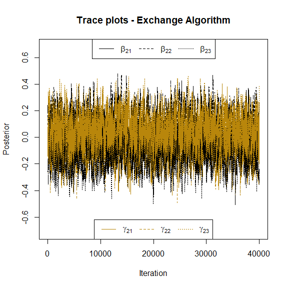

<!-- README.md is generated from README.Rmd. Please edit that file -->

# MultRegCMP

MultRegCMP is an R package designed to fit a Bayesian Regression Model
for multivariate count data. We assume that the data is distributed
according to the Conway-Maxwell-Poisson distribution (Conway and Maxwell
1962), and for each response variable, we can associate different
covariates. This model allows us to account for correlations between the
counts by using latent effects based on the Chib and Winkelmann (2001)
proposal.

You can find more details about this model once our paper is published.

## Installation

You can install the development version of MultRegCMP like so:

``` r
devtools::install_github("mauroflorez/MultRegCMP")
```

### Load package

Here you can see how we can use the package and their functions

``` r
library(MultRegCMP)
## basic example code
```

## Main functions

The function `com_sampler(mu, nu)` allow us to sample data from the CMP
with location parameter mu and shape parameter nu. If `ndraws = TRUE` it
returns the number of draws needed to sample `n` data. It uses the
rejection sampler proposed by Benson and Friel (2021).

``` r
com_sampler(4, 5)
#> [1] 4

com_sampler(1, 0.5, 10, ndraws = TRUE)
#> $samples
#>  [1] 1 1 4 2 5 1 2 0 2 1
#> 
#> $draws
#> [1] 20
#> 
#> $log_Bf
#> [1] 1.591368
```

Functions `log_cmp` calculate the log-likelihood of the unnormalized
component of the CMP, while `llk_cmp` calculate the approximate
log-likelihood of the distribution as suggested by Benson and Friel
(2021).

``` r
llk_cmp(y = 2, mu = 2, nu = 1.5)
#> [1] -1.148141
```

Finally, to implement our model we use the main function `mcmc_cmp`.
This function requires two important componentes; `X` is the covariates
information, this object is a list, where every element of the list is a
covariance matrix for every response. On the other hand, `y` is a matrix
(nxJ) containing all the J response variables and the n observations. We
can see an example below

``` r
n = 50; J = 2
X = list(matrix(rnorm(3*n), ncol = 3), matrix(rnorm(3*n), ncol = 3))
beta <- list(c(1,0.1, 1), c(0, 0.5, -0.5))
mu <- exp(prod_list(X, beta))
y = matrix(rpois(n = length(mu), lambda = mu), nrow = n)
```

To fit our model, we require the number of draws `S`, the number of
samples burn `nburn` and some parameters for the MCMC - Exchange
Algorithm steps.

``` r
fit <- mcmc_cmp(y, X, S = 40000, nburn = 1000, v0 = 40, scale_cov_b = 0.8, scale_cov_beta = 0.04, scale_cov_gamma = 0.06, progress = "bar")
```

### Parameter Estimation

We can see the estimations of the model as

``` r
fit$estimation_beta
#> [[1]]
#> [1] 0.30977519 0.03614515 0.43375142
#> 
#> [[2]]
#> [1]  0.03725911  0.13443572 -0.16555769
fit$estimation_gamma
#> [[1]]
#> [1] -0.08724856 -0.01579589 -0.09731214
#> 
#> [[2]]
#> [1] -0.02521666 -0.04461323  0.08724741
```

Also, we plot the trace plots of the parameters associated to the
location and shape parameters to check convergence visually. Here we can
see the trace plots associated to the first response variable:


and similarly for the parameters of the second response.



Additionally `DIC_cmp` allows to calculate an approximation of the
Deviance Information Criterion (Spiegelhalter et al. 2002) of the fitted
model for each response.

``` r
DIC_cmp(fit)
#> [1] 143.4882 143.9974
```

## References

<div id="refs" class="references csl-bib-body hanging-indent"
entry-spacing="0">

<div id="ref-benson2021" class="csl-entry">

Benson, Alan, and Nial Friel. 2021. “<span class="nocase">Bayesian
inference, model selection and likelihood estimation using fast
rejection sampling: the Conway-Maxwell-Poisson distribution</span>.”
*Bayesian Analysis* 16 (3): 905–31.

</div>

<div id="ref-chib2001" class="csl-entry">

Chib, Siddhartha, and Rainer Winkelmann. 2001.
“<span class="nocase">Markov chain Monte Carlo analysis of correlated
count data</span>.” *Journal of Business & Economic Statistics* 19 (4):
428–35.

</div>

<div id="ref-conway1962" class="csl-entry">

Conway, Richard W, and William L Maxwell. 1962. “A Queuing Model with
State Dependent Service Rates.” *Journal of Industrial Engineering* 12
(2): 132–36.

</div>

<div id="ref-spiegelhalterbayesian" class="csl-entry">

Spiegelhalter, David J., Nicola G. Best, Bradley P. Carlin, and Angelika
Van Der Linde. 2002. “<span class="nocase">Bayesian Measures of Model
Complexity and Fit</span>.” *Journal of the Royal Statistical Society
Series B: Statistical Methodology* 64 (4): 583–639.
<https://doi.org/10.1111/1467-9868.00353>.

</div>

</div>
