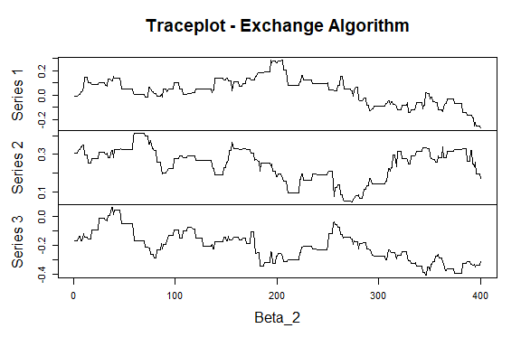
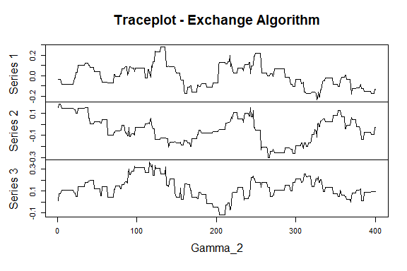

<!-- README.md is generated from README.Rmd. Please edit that file -->

# MultRegCMP

MultRegCMP is an R package designed to fit a Bayesian Regression Model
for multivariate count data. We assume that the data is distributed
according to the Conway-Maxwell-Poisson distribution, and for each
response variable, we can associate different covariates. This model
allows us to account for correlations between the counts.

You can find more details about this model once our paper is published.

## Installation

You can install the development version of MultRegCMP like so:

``` r
devtools::install_github("mauroflorez/MultRegCMP")
```

## Example

Here you can see how we can use the package and their functions

``` r
library(MultRegCMP)
## basic example code
```

The function `com_sampler(mu, nu)` allow us to sample data from the CMP
with location parameter mu and shape parameter nu. If `ndraws = TRUE` it
returns the number of draws needed to sample `n` data.

``` r
com_sampler(4, 5)
#> [1] 4

com_sampler(1, 0.5, 10, ndraws = TRUE)
#> $samples
#>  [1] 6 2 1 4 1 0 3 0 0 0
#> 
#> $draws
#> [1] 12
#> 
#> $log_Bf
#> [1] 1.591368
```

Functions `log_cmp` calculate the log-likelihood of the unnormalized
component of the CMP, whilea `llk_cmp` calculate the approximate
log-likelihood of the distribution as suggested by Benson and Friel
(2021).

``` r
llk_cmp(y = 2, mu = 2, nu = 1.5)
#> [1] -1.137954
```

Finally, to implement our model we use the main function `mcmc_cmp`.
This function requires two important componentes; `X` is the covariates
information, this object is a list, where every element of the list is a
covariance matrix for every response. On the other hand, `y` is a matrix
(nxJ) containing all the J response variables and the n observations. We
can see an example below

``` r
n = 50; J = 2
X = list(matrix(rnorm(3*n), ncol = 3), matrix(rnorm(3*n), ncol = 3))
beta <- list(c(1,0.1, 1), c(0, 0.5, -0.5))
mu <- exp(prod_list(X, beta))
y = matrix(rpois(n = length(mu), lambda = mu), nrow = n)
```

To fit our model, we require the number of draws `S`, the number of
samples burn `nburn` and some parameters for the MCMC - Exchange
Algorithm steps.

``` r
fit <- mcmc_cmp(y, X, S = 40000, nburn = 1000, v0 = 40, scale_cov_b = 0.8, scale_cov_beta = 0.04, scale_cov_gamma = 0.06, progress = "bar")
```

We can see the estimations of the model as

``` r
fit$estimation_beta
#> [[1]]
#> [1] 0.442922680 0.007676316 0.365732306
#> 
#> [[2]]
#> [1] -0.02466386  0.13750199 -0.11584390
fit$estimation_gamma
#> [[1]]
#> [1] -0.15424516  0.01658011 -0.10973352
#> 
#> [[2]]
#> [1]  0.004392599 -0.078796921  0.045069834
```

or see the trace plots

``` r
plot.ts(fit$posterior_beta[[1]], main = "Traceplot - Exchange Algorithm", xlab = "Beta_1")
```


``` r
plot.ts(fit$posterior_beta[[2]], main = "Traceplot - Exchange Algorithm", xlab = "Beta_2")
```



and for the shape parameters

``` r
plot.ts(fit$posterior_gamma[[1]], main = "Traceplot - Exchange Algorithm", xlab = "Gamma_1")
```


``` r
plot.ts(fit$posterior_gamma[[2]], main = "Traceplot - Exchange Algorithm", xlab = "Gamma_2")
```



Additionally `DIC_cmp` allows to calculate an approximation of the
Deviance Information Criterion of the fitted model for each response.

``` r
DIC_cmp(fit)
#> [1] 141.9376 118.0297
```
